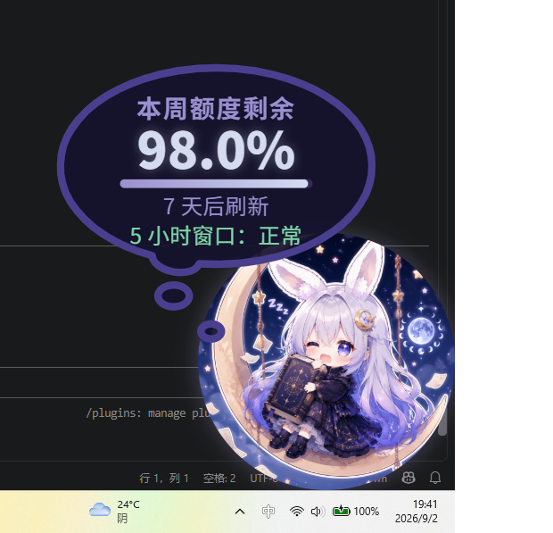

# 月兔娘 · Kimi 额度桌面挂件（kimi-rabbit-widget）

> 常驻屏幕右下角的「月兔娘」桌面悬浮窗，替你盯着 Kimi Coding Plan 的额度。
>
> 她住在月球暗面，安静、爱读书，熬夜陪你写代码——额度快没的时候，她会替你着急。



## 功能列表

- **本周额度**：已用/剩余百分比（大数字 + 进度条），数字变化滚动动画，下次刷新倒计时（「X 天后刷新」）
- **5 小时滚动窗口状态**：正常 / 接近限流 / 未知，一眼看清当前频率风险
- **加油包余额**：数据源可得时显示，不可得时菜单自动隐藏该项
- **每轮对话消耗估算**：每轮对话结束弹出本轮 token 消耗泡泡（可在菜单关闭）
- **60 秒自动刷新 + 点击兔娘手动刷新**
- **拖拽 + 四边四分之一吸附**；吸附到左半屏时整体水平镜像翻转（文字同步反向）
- **按压 Q 弹**：按压时底部坐标不变的玩偶手感，带回弹 overshoot
- **汉堡菜单**：大小滑块、音效套装切换（小黄鸭 / 音效1）与音量、气泡开关、每轮消耗开关与自动关闭秒数、数据源切换、周额度上限与 5h 告警阈值设置
- **随机台词气泡**：加权随机（含 gif 动图台词组，素材缺失时自动降级文字），5 秒自动收起；额度低于 20% 时月兔娘会开始着急
- 配色：暗夜蓝紫 + 月光银

## 安装步骤

### 从源码构建（当前方式）

前置依赖：

- [Node.js](https://nodejs.org/) 18+
- [Rust 工具链](https://rustup.rs/)（stable）
- Windows 10/11（系统自带 WebView2 运行时；过旧系统需安装 [WebView2](https://developer.microsoft.com/microsoft-edge/webview2/)）

```bash
git clone https://github.com/youzy139/kimi_zhuochong.git
cd kimi_zhuochong
npm install
npm run dev      # 开发模式运行（带热重载）
npm run build    # 产出安装包（src-tauri/target/release/bundle/）
```

构建产物约 10 MB 量级，常驻内存占用远低于 Electron 方案。

### 使用前提

挂件的数据来自本机 Kimi Code CLI 的会话记录，因此需要：

- 已安装并登录 [Kimi Code CLI](https://www.kimi.com/code/docs/en/)（`kimi` 命令可用）
- 正常使用过 Kimi Code（产生过会话记录，记账模式才有数据）

## 数据获取原理

Kimi Code **没有公开的额度查询 API**。官方查询途径只有 CLI 内的 `/usage` 命令和 Kimi Code 控制台网页。本挂件把数据源做成**可插拔适配层**，内置两种数据源：

### 记账模式（ledger，默认，开箱即用）

Kimi Code CLI 会把每次模型调用的真实 token 用量写入本地会话日志
`~/.kimi-code/sessions/*/session_*/agents/*/wire.jsonl`（`usage.record` 事件，
含输入/输出/缓存 token 明细与毫秒时间戳）。

挂件增量扫描这些日志，本地聚合出：

- 本周已用 token（按 7 天周期归档，首次运行自动锚定周期起点）
- 最近 5 小时用量（对照你设置的告警阈值给出窗口状态）
- 每轮对话消耗（最新一条 turn 级用量记录）

优点：零凭据、离线可用、稳定。注意：额度**上限**官方不对外暴露，
需要在菜单里手动填一次你的周额度总量（token 数），挂件才能显示百分比；
其他设备上的消耗不在本机日志里，会漏记。

### CLI 解析模式（cli，增强数据源）

通过伪终端（portable-pty）在后台拉起一个隐藏的 `kimi` 进程，
发送 `/usage` 命令并解析官方面板输出，拿到官方口径的周额度百分比、
5 小时窗口状态与刷新时间。结果缓存 10 分钟，避免频繁起进程。

该模式依赖 TUI 输出格式，Kimi Code 改版可能失效——失效时**自动降级到
记账模式**，挂件不会报错崩溃。

### 降级与切换

- `auto`（默认）：优先 CLI 解析，失败自动用记账模式兜底
- 菜单 → 数据源 可手动锁定 `ledger` 或 `cli`
- 任何时刻数据源异常，挂件显示最近一次成功数据而不是报错

### 隐私与配置

- 配置文件在 `~/.kimi-rabbit-widget/config.json`，只存界面偏好与你手填的额度上限
- 不保存任何登录令牌、API Key；额度数据只读本机日志、不出本机
- 仓库 `.gitignore` 已排除 token、本地配置与构建产物

## 各模式配置方法

| 配置项 | 位置 | 说明 |
|---|---|---|
| 数据源 | 汉堡菜单 → 数据源 | auto / ledger / cli |
| 周额度上限 | 汉堡菜单 → 周额度 | 你的 Coding Plan 周额度 token 总量，填了才有百分比与进度条 |
| 5h 告警阈值 | 汉堡菜单 → 5h 阈值 | 最近 5 小时用量超过该值显示「接近限流」；留空则显示「未知」 |
| 周周期锚点 | 自动生成 | 首次运行以当时时间为周期起点；每 7 天自动滚动归档 |
| 加油包 | 暂不可得 | 无任何公开/本地途径获取加油包余额，菜单自动隐藏；后续若控制台令牌模式实现将补充 |

## 技术栈

- [Tauri v2](https://v2.tauri.app/)（Rust + 系统 WebView2）：透明无边框置顶窗、约 10 MB 包体
- 前端：原生 HTML/JS（无框架、无构建步骤），挂件交互移植自参考项目并整体换皮
- 数据源适配层：Rust，可插拔 trait + 自动降级编排

## 致谢与许可

本项目灵感与挂件交互实现参考了
[DeepSeek-Balance-Whale-Widget](https://github.com/MeteorNOX/DeepSeek-Balance-Whale-Widget)，
作者 **MeteorNOX**，原项目以 MIT 协议开源。拖拽吸附、按压 Q 弹、气泡动画、
加权随机台词等交互设计均移植自该项目，在此致谢。

本项目本身同样以 [MIT License](LICENSE) 开源。

「月兔娘」形象素材为 AI 生成，仅供个人学习交流使用。

## 免责

本项目与 Moonshot AI / Kimi 官方无关，为个人开源作品。
额度数据来源于对本机 Kimi Code CLI 会话日志的读取与 `/usage` 输出解析，
仅供参考，准确额度以 Kimi Code 控制台为准。
